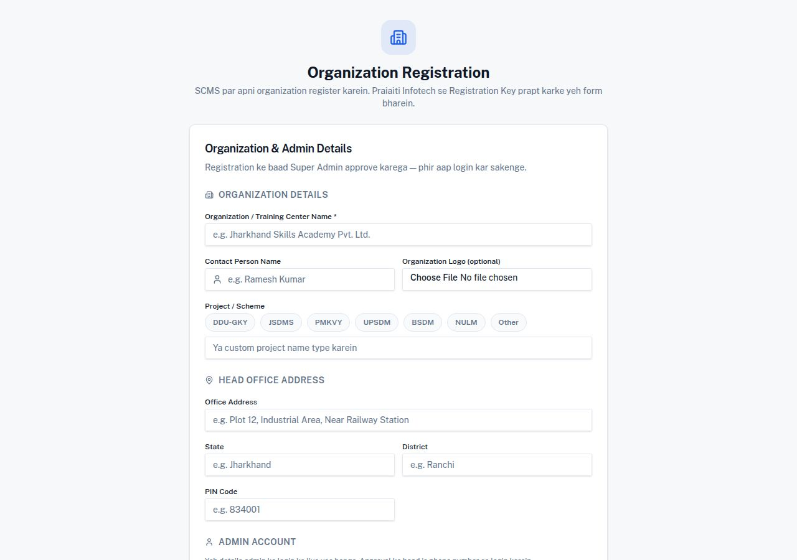
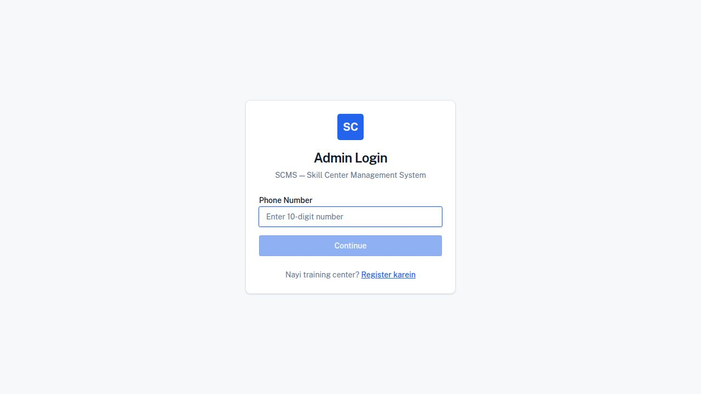
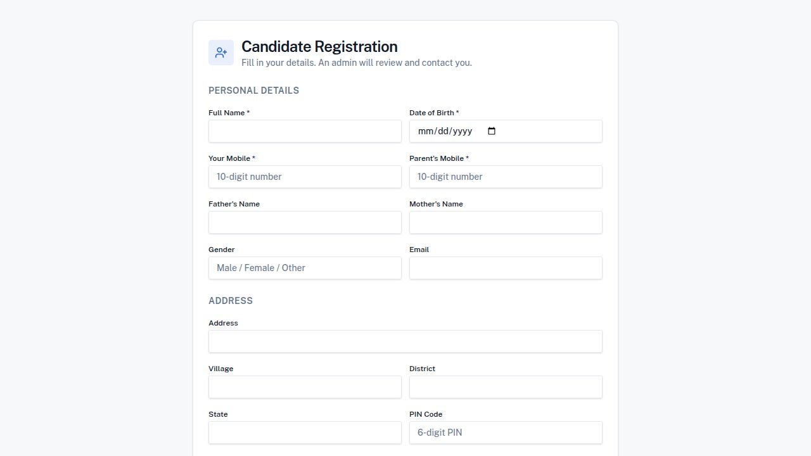

# SCMS — User Guide
### Skill Center Management System by Praiaiti Infotech

---

## Table of Contents
1. [System Overview](#1-system-overview)
2. [Nayi Organization Register Karna](#2-nayi-organization-register-karna)
3. [Admin Login](#3-admin-login)
4. [Super Admin — Company Approve Karna](#4-super-admin--company-approve-karna)
5. [Super Admin — Subscription Plans](#5-super-admin--subscription-plans)
6. [Staff Management](#6-staff-management)
7. [Candidate Management](#7-candidate-management)
8. [Attendance Management](#8-attendance-management)
9. [Field Staff Mobile App](#9-field-staff-mobile-app)
10. [Reports](#10-reports)

---

## 1. System Overview

SCMS ek white-label SaaS platform hai jo DDU-GKY, JSDMS, PMKVY, UPSDM, BSDM jaise skill training centers ke liye banaya gaya hai.

**Teen main parts hain:**

| Part | Use |
|---|---|
| **Admin Panel** (Web) | Training center admin ke liye — staff, candidate, attendance manage karna |
| **Field Staff App** (Mobile) | Staff ke liye — check-in/out, candidate registration, attendance |
| **Super Admin Panel** (Web) | Praiaiti Infotech ke liye — sabhi organizations manage karna |

---

## 2. Nayi Organization Register Karna

**URL:** `/company-register`

### Step-by-step:

**Step 1 — Organization Details bharein:**
- Organization / Training Center Name (zaroori)
- Contact Person Name
- Project/Scheme chunein: DDU-GKY, JSDMS, PMKVY, UPSDM, BSDM, NULM, Other
- Organization Logo upload karein (optional)

**Step 2 — Head Office Address:**
- Office Address
- State aur District
- PIN Code

**Step 3 — Admin Account Details:**
- Admin Name
- Phone Number (yahi login ID hoga)
- Email
- MPIN (4-digit)

**Step 4 — Registration Key:**
- Praiaiti Infotech se prapt Registration Key enter karein

> **Note:** Registration submit karne ke baad Super Admin approve karega — tab hi login hoga.

---

## 3. Admin Login

**URL:** `/login`

### Steps:
1. **Phone Number** enter karein (10 digit)
2. **Continue** click karein
3. **MPIN** (4-digit) enter karein
4. Login ho jayega

> **Super Admin credentials:** Phone: `9999999999` | MPIN: `1234`

---

## 4. Super Admin — Company Approve Karna

Login ke baad sidebar mein **"All Companies"** par click karein.

### Tabs:

| Tab | Kaam |
|---|---|
| **All Companies** | Sabhi registered organizations |
| **Pending Companies** | Approval waiting companies — Approve/Reject kar sakte hain |
| **Pending Centers** | Approval waiting training centers |

### Company Approve kaise karein:
1. "Pending Companies" tab open karein
2. Company ke naam par click karein
3. **Approve** button click karein → Company active ho jayegi, admin login kar sakta hai
4. **Reject** button click karein → Reason dene ka option milega

---

## 5. Super Admin — Subscription Plans

Sidebar mein **"Subscription Plans"** click karein.

### Features:

**Summary Cards (top mein):**

| Card | Matlab |
|---|---|
| Active Subscriptions | Active plans wali companies |
| Expiring in 30 Days | Jaldi expire hone wali |
| Expired | Expired subscriptions |
| No Subscription | Koi plan nahi |

> Cards par click karne se neeche table automatically filter ho jaata hai.

**Table mein har company ke liye:**
- Plan (Basic / Standard / Premium)
- Payment Status (Paid / Pending / Expired)
- Expiry Date
- Current Status

**Subscription Set kaise karein:**
1. Company row mein **"Set"** button click karein
2. Plan chunein: Basic / Standard / Premium
3. Start Date aur End Date set karein
4. Payment Status chunein: Paid / Pending / Expired
5. **Save** click karein

---

## 6. Staff Management

Sidebar mein **"Staff Management"** click karein.

### Staff Categories:

**Academic Staff:**
- Center Head, MIS Executive, Placement Incharge
- Trainer, IT Trainer, Soft Skills Trainer
- Receptionist, Counselor, Tele Caller
- Hostel Warden (Male/Female)

**Ground Staff:**
- Office Boy, Security Guard (Day/Night)
- Head Cook, Assistant Cook, Cook Helper
- Care Taker, Sweeper, Toilet Cleaner, Other Staff

### Naya Staff Add kaise karein:
1. **"Add Staff"** button click karein
2. Category chunein: **Academic** ya **Ground**
3. Designation (role) chunein
4. Personal details bharein: Name, Phone, Address
5. Block aur PIN Code bharein
6. **Save** click karein

---

## 7. Candidate Management

Sidebar mein **"Candidates"** click karein.

### Candidate Registration (Mobile App se):

**Form mein sections:**
- **Personal Details:** Full Name, DOB, Mobile, Parent's Mobile, Father/Mother Name, Gender, Email
- **Address:** Village, District, State, PIN Code
- **Documents:** Aadhaar, Photo, Signature

### Admin Panel mein:
- Candidates ki list dekhein
- Status dekhein: Pending / Approved / Rejected
- Approve ya Reject karein comment ke saath
- PDF generate karein

---

## 8. Attendance Management

### Center Attendance:
Sidebar mein **"Center Attendance"** click karein.

- Daily staff attendance dekhein
- Present / Absent / Late filter karein
- Date-wise attendance report

### Field Attendance:
Sidebar mein **"Field Attendance"** click karein.

- Field staff ki GPS-based attendance
- Check-in/out time dekhein
- Location map par track karein

### Live Staff Map:
Sidebar mein **"Live Staff Map"** click karein.

- Real-time staff locations map par dekhein
- 15 second mein auto-refresh hota hai
- Staff ka naam aur last seen time dikhai deta hai

---

## 9. Field Staff Mobile App

### Welcome Screen — 3 Options:

| Option | Kaam |
|---|---|
| **Login** | Existing staff login karey |
| **Center Setup** | Nayi training center register karein |
| **Staff Registration** | Naya staff register karein |

### Staff Login:
1. Phone Number enter karein
2. MPIN (4-digit) enter karein
3. Dashboard open hoga

### Staff ke Features:

**Check-in/Check-out:**
- Selfie + GPS location required
- Real-time shift timer dikhai deta hai

**Candidate Registration:**
- Document scan (Auto-scan camera)
- Aadhaar, Photo, Signature capture
- Center TC ID auto-fill ho jaata hai

**Attendance Calendar:**
- Monthly view
- Present (green) / Partial (amber) / Absent (red)
- Din ki detail: check-in/out time, trips, distance

**Leaderboard:**
- Top 5 staff by KM, Trips, Candidates
- Filter: Today / Week / Month

---

## 10. Reports

Sidebar mein **"Reports"** click karein.

### Available Reports:
- **Staff Report** — Attendance, KM, trips summary
- **Candidate Report** — Registration, approval status
- **Vehicle/KM Report** — Odometer readings, trip ledger

### Export:
- CSV download
- WhatsApp share option

---

## Important Links

| Feature | URL |
|---|---|
| Admin Login | `/login` |
| New Organization Register | `/company-register` |
| Candidate Registration (public) | `/register` |

---

## Support

**Praiaiti Infotech**
Developer: Anil Yadav
Version: 1.0.2

---
*Yeh guide SCMS v1.0.2 ke liye hai.*
